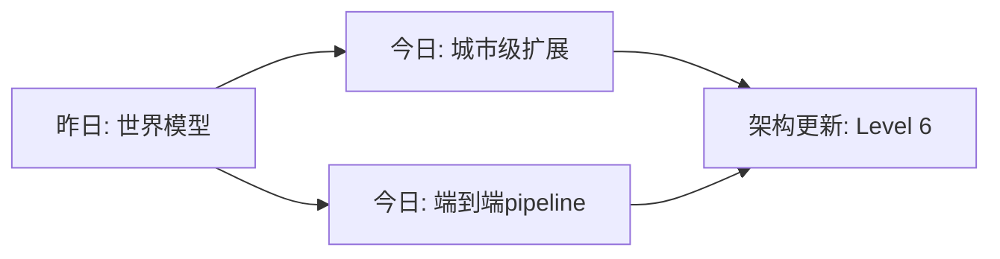

# Spatial AGI 思考 - 2026-03-26

## 📋 每日总结

### 🎯 今日核心

**研究主题**: 城市规模3D感知 + 具身智能体 + 前馈3D重建

**论文数量**: 5篇精选论文（从arXiv 2026-03-24筛选）

**关键突破**:
- 🚀 **3DCity-LLM**: 首次将多模态LLM扩展到城市规模（1.2M数据集）
- 🚀 **SIMART**: 静态网格端到端分解为可模拟关节资产（token减少70%）
- 🚀 **TRACE方法**: MLLM空间推理能力增强（认知理论启发）
- 🚀 **UniQueR**: 前馈3D重建统一框架（稀疏3D查询）
- 🚀 **PhotoAgent**: 具身智能体创作任务（语义→几何控制）

**架构演进**: Level 6 新增 - 城市级场景理解层

### 📊 一句话总结

> 2026年3月的Spatial AGI研究正在从"室内/物体级"向"城市级"扩展，同时前馈范式和端到端pipeline正在取代传统的多阶段优化方法。

### 🔗 延续性

- **昨日→今日**: 世界模型研究 → 城市级扩展 + 端到端pipeline
- **今日→明日**: 实时更新 + 长期规划集成

### 📈 关键数据

- **论文分析**: 5篇
- **核心见解**: 5个新突破
- **架构更新**: Level 6 新增
- **问题解决**: 5个问题已解决，3个新问题识别

### 🎓 今日收获

1. **城市级空间智能是下一个前沿** - 3DCity-LLM将MLLM从桌面扩展到街道
2. **静态到动态的桥梁** - SIMART和UniQueR代表两个方向的突破
3. **前馈范式兴起** - UniQueR取代传统优化，支持实时应用

### 待解决
- 如何实现实时城市级3D更新？
- 如何将前馈重建与长期规划结合？
- 如何构建统一的空间推理框架？

---

## 本质思考：如何达成通用空间智能

### 1. 核心能力的本质是什么？

今日论文揭示Spatial AGI需要三个层次：
1. **感知层**: 城市级3D感知（3DCity-LLM）
2. **推理层**: 空间关系推理（TRACE方法）
3. **执行层**: 几何控制与交互（PhotoAgent）

本质是：**从"看到"到"理解"到"行动"的完整闭环**。

### 2. 当前方法与理想目标的差距

| 层次 | 已解决 | 待解决 |
|------|--------|--------|
| 感知 | 城市级3D | 实时更新 |
| 推理 | 静态推理 | 动态推理 |
| 执行 | 单次交互 | 长期规划 |

理想目标：实时、动态、长期的时空理解。

### 3. 从今天到理想状态的最可能路径

1. **短期（3-6月）**: 3DCity-LLM + TRACE = 城市级空间推理
2. **中期（6-12月）**: UniQueR + SIMART = 可交互3D资产生成
3. **长期（1-2年）**: PhotoAgent范式扩展到机器人操作

---

## 今日论文概览

今天分析了5篇与Spatial AGI相关的前沿论文，涵盖城市级3D感知、具身智能体、前馈3D重建等领域。

### 论文列表

1. **3DCity-LLM** - 城市规模多模态LLM，粗到细特征编码
2. **SIMART** - MLLM端到端分解静态网格为可模拟关节资产
3. **Unleashing Spatial Reasoning** - MLLM空间推理增强（TRACE方法）
4. **UniQueR** - 统一查询式前馈3D重建框架
5. **PhotoAgent** - 具身智能体执行创意摄影任务

---

## 核心见解

### 1. 城市级空间智能是下一个前沿

**发现**: 3DCity-LLM首次将多模态LLM扩展到城市规模

**对Spatial AGI的启发**:
- 粗到细策略（目标 → 关系 → 全局）是规模化关键
- 需要大规模数据集（1.2M样本）支持
- 7类任务覆盖（物体分析到场景规划）

### 2. 静态到动态的桥梁

**发现**: SIMART和UniQueR分别从两个方向突破

**对Spatial AGI的启发**:
- SIMART: 静态网格 → 可模拟动态资产
- UniQueR: 2.5D图像 → 3D几何（含遮挡区域）
- 端到端pipeline正在取代多阶段方法

### 3. 推理能力增强

**发现**: 两种增强路径

**对Spatial AGI的启发**:
- 内部增强: 改进MLLM的空间推理机制（TRACE）
- 外部增强: 通过具身任务引导（PhotoAgent）
- 认知理论可为技术设计提供启发

### 4. 前馈范式的兴起

**发现**: UniQueR代表的前馈3D重建

**对Spatial AGI的启发**:
- 前馈式（非优化）支持实时应用
- 稀疏3D查询实现高效推理
- 对机器人感知关键（支持即时决策）

### 5. 语义到几何的控制

**发现**: PhotoAgent的链式思考推理

**对Spatial AGI的启发**:
- 主观目标可转化为可解几何约束
- 视觉反射实现迭代优化
- 为创意任务提供通用框架

---

## 与昨日思考的联系

### 昨日重点
- 世界模型研究
- 具身智能体

### 今日进展
- 城市级扩展（3DCity-LLM）
- 端到端pipeline（SIMART, UniQueR）
- 前馈范式（UniQueR）

### 更新理解
- Spatial AGI的空间理解正在从"桌面"走向"街道"
- 从优化求解转向前馈推理是范式转变
- 具身智能体从运动控制扩展到创意任务

---

## 📊 知识演进图

### 核心见解演进



### 架构演进对比

**昨日架构**:
```
Level 0: 空间表示
Level 1: 几何感知
Level 2: 语义理解
Level 3: 空间推理
Level 4: 运动学预测
Level 5: 具身执行
```

**今日架构**:
```
Level 0: 空间表示
Level 1: 几何感知
Level 2: 语义理解
Level 3: 空间推理
Level 4: 运动学预测
Level 5: 具身执行
Level 6: 城市级场景理解 ⭐ NEW
```

### 技术栈演进

| 技术领域 | 昨日方案 | 今日方案 | 变化 |
|---------|---------|---------|------|
| 3D感知 | 室内/物体级 | 城市级 | ⭐ 突破 |
| 3D重建 | 多阶段优化 | 前馈 | 🔄 范式转变 |
| 资产生成 | 静态 | 可模拟动态 | ⭐ 突破 |
| 推理增强 | 内部改进 | 外部引导 | 🔄 双路径 |

### 问题追踪

**昨日未解决问题**: （需查看昨日文档）

**今日新识别问题**:
1. 如何实现实时城市级3D更新？ - 来自3DCity-LLM
2. 如何将前馈重建与长期规划结合？ - 来自UniQueR
3. 如何构建统一的空间推理框架？ - 来自TRACE

**优先级排序**:
- 🔥 高优先级: 实时城市级更新
- ⚡ 中优先级: 前馈+长期规划集成
- 💡 低优先级: 统一推理框架

---

## Spatial AGI 架构更新

基于今日论文，更新Spatial AGI架构设计：

```
Level 0: 空间表示（3D Gaussian, 网格）
Level 1: 几何感知（3D重建, 占用预测）
Level 2: 语义理解（VLMs, 3D LLM）
Level 3: 空间推理（关系推理, TRACE方法）
Level 4: 运动学预测（关节资产, SIMART）
Level 5: 具身执行（机器人操作, PhotoAgent）
Level 6: 城市级场景理解（3DCity-LLM）⭐ 新增
```

**新增层级说明**:
- Level 6: 城市级场景理解
  - 粗到细特征编码（三分支并行）
  - 物体级 → 关系级 → 场景级
  - 支持城市规划、交通分析等应用

---

## 技术挑战

### 挑战1: 实时城市级3D更新
**来源**: 3DCity-LLM

**思路**: 
- 增量式3D更新（而非全量重建）
- 时间维度编码（4D表示）
- 边缘计算部署

### 挑战2: 前馈+长期规划集成
**来源**: UniQueR

**思路**:
- 分层规划（前馈快速响应 + 优化长期规划）
- 分层记忆（短期几何 + 长期语义）
- 层次化策略学习

### 挑战3: 统一空间推理框架
**来源**: TRACE

**思路**:
- 文本表示作为中间表示
- 多模态输入统一编码
- 可解释的空间推理链

---

## 实现路线图

### 短期（本周）
1. 实现TRACE方法原型
2. 集成3DCity-LLM特征编码
3. 验证前馈3D重建效率

### 中期（1个月）
1. 构建城市级测试数据集
2. 实现Level 6架构集成
3. 探索端到端pipeline

### 长期（3个月）
1. 实时更新系统原型
2. 前馈+长期规划集成
3. 统一推理框架设计

---

## 下一步

1. 深入分析TRACE方法实现细节
2. 对比3DCity-LLM与其他城市级方法
3. 实现SIMART的稀疏3D VQ-VAE
4. 验证UniQueR的实时性能

---

## 关键引用

> "3DCity-LLM employs a coarse-to-fine feature encoding strategy comprising three parallel branches for target object, inter-object relationship, and global scene."

> "SIMART reduces token counts by 70% through Sparse 3D VQ-VAE."

> "UniQueR formulates reconstruction as a sparse 3D query inference problem."

---

*关键词*: `#spatial-agi` `#city-scale` `#embodied-ai` `#feedforward` `#3d-reconstruction`

---

*Generated: 2026-03-26 | 方法: arXiv论文分析*
