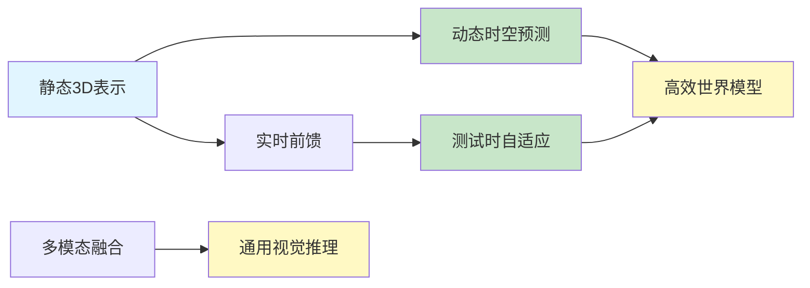

# Spatial AGI Daily Thinking - 2026-04-08

## 📋 每日总结

### 🎯 今日核心

**研究主题**: 高效世界模型 + 视觉推理 + 测试时自适应

**论文数量**: 5篇精选论文（arXiv 2026-04-06）

**关键突破**: 
- 🚀 **DeltaTok**: 高效生成式世界模型，35x fewer参数，2000x fewer FLOPs
- 🚀 **Vero**: 开源RL recipe实现通用视觉推理，SOTA性能
- 🚀 **LoMa**: 数据驱动local feature matching，性能大幅提升
- 🚀 **PointTPA**: 测试时参数自适应，低开销场景特化
- 🚀 **SpatialEdit**: 细粒度空间编辑benchmark + 50万合成数据

### 📊 一句话总结

> "今日核心：从静态空间理解向动态时空预测演进。DeltaTok展示特征空间的压缩表示优势，Vero证明开源RL可达到闭源水平，PointTPA开创推理时参数自适应新范式。Spatial AGI正从'看到什么'向'预测会怎样'转变。"

### 🔗 延续性

**昨日→今日**: 实时3D重建 → 高效时空预测（DeltaTok）+ 推理时自适应（PointTPA）
**明日→明日**: 可能方向：时空预测 + 语义理解集成、参数自适应 + 持续学习

### 📈 关键数据

- **DeltaTok**: 35x fewer参数, 2000x fewer FLOPs, 1024x token压缩
- **Vero**: 600K样本, 59数据集, 6任务类别, 3.7-5.5pts提升
- **SpatialEdit-500k**: 50万合成样本

### 🎓 今日收获

**Top 3 发现**:
1. **特征空间学习是未来** - DeltaTok证明在VFM特征空间中预测比像素空间更高效
2. **开源可复制闭源水平** - Vero展示正确的RL recipe可以匹敌闭源系统
3. **测试时自适应新范式** - PointTPA开创了低成本场景特化道路

**最大惊喜**: 测试时参数自适应（TTA）在3D场景理解中的应用，证明传统静态网络可以动态适应

**待解决**: 如何将DeltaTok的世界模型与PointTPA的自适应结合？

---

## 本质思考：如何达成通用空间智能

### 1. 核心能力的本质是什么？

**今日发现**:
- DeltaTok揭示：理解空间的变化比理解空间的当前状态更有价值（delta > static）
- Vero展示：规模化RL可以学习通用空间推理能力
- PointTPA证明：推理时自适应是高效的场景特化

**本质**: Spatial AGI需要"预测能力"（未来状态）+ "适应能力"（动态调整）+ "推理能力"（空间关系）

### 2. 当前方法与理想目标的差距在哪里？

**差距分析**:
- ✅ 已有：高效空间表示（DeltaTok）、规模数据（Vero-600K）、测试时自适应（PointTPA）
- ❌ 缺失：长期时空预测、因果推理、物体持久性
- ⚠️ 瓶颈：多假设生成与选择的平衡、泛化能力与特异性

**最大瓶颈**: 如何同时实现高效预测和理解根本原因（因果）

### 3. 从今天到理想状态，最可能的路径是什么？

**技术路线预测**:
1. **短期（3-6月）**: DeltaTok特征空间 + PointTPA自适应 → 高效时空预测
2. **中期（6-12月）**: 时空预测 + Vero推理 → 理解空间变化的原因
3. **长期（1-2年）**: 统一世界模型（预测 + 推理 + 自适应）

**关键突破点**:
- Delta token → 时序预测的压缩表示
- 测试时自适应 → 低成本场景特化
- RL scaling → 通用空间推理

---

## 今日论文概览

今天精读了5篇与Spatial AGI相关的前沿论文，涵盖高效世界模型、视觉推理、测试时自适应等领域。

### 论文列表

1. **DeltaTok** - 2604.04913v1
   - 核心: 高效生成式世界模型
   - 关键: Delta token压缩 + 特征空间预测
   - 贡献: 35x参数减少，2000x FLOPs减少

2. **Vero** - 2604.04917v1
   - 核心: 开源RL recipe
   - 关键: 600K样本 + 任务路由机制
   - 贡献: 通用视觉推理SOTA

3. **LoMa** - 2604.04931v1
   - 核心: 数据驱动local feature matching
   - 关键: 大规模数据混合物
   - 贡献: 3D重建基础能力提升

4. **PointTPA** - 2604.04933v1
   - 核心: 测试时参数自适应
   - 关键: DPP动态权重 + SNG邻域分组
   - 贡献: 低开销场景特化

5. **SpatialEdit** - 2604.04911v1
   - 核心: 细粒度空间编辑benchmark
   - 关键: 50万合成数据 + 多维度评估
   - 贡献: 数据瓶颈解决

## 核心见解

### 1. 特征空间学习是未来方向

**从DeltaTok获得**:
- ✅ 在VFM特征空间中预测比像素空间更高效
- ✅ Delta token实现1024x压缩
- ✅ 生成式方法可以预测多样化未来

**对Spatial AGI的启发**:
Spatial AGI需要学习空间的"变化模式"而非"静态表示"。特征空间保留了语义信息和空间关系的压缩表示，是高效预测的基础。

### 2. 测试时自适应新范式

**从PointTPA获得**:
- ✅ 推理时生成输入感知的网络参数
- ✅ 保持主体网络不变，低参数开销
- ✅ 每个场景可以有不同的行为模式

**对Spatial AGI的启发**:
资源受限的Spatial AGI系统可以通过测试时自适应来适应动态环境，而非在训练时学习所有场景。

### 3. 开源RL recipe可以匹敌闭源

**从Vero获得**:
- ✅ 正确的数据策略和奖励设计比模型架构更重要
- ✅ 600K样本规模可以显著提升能力
- ✅ 任务路由机制统一处理异构任务

**对Spatial AGI的启发**:
构建Spatial AGI不需要秘密的RL pipeline，开源社区可以通过正确的方法论实现甚至超越闭源系统。

### 4. 数据瓶颈可以通过合成数据解决

**从SpatialEdit和LoMa获得**:
- ✅ Blender pipeline可以生成大规模可控数据
- ✅ 合成数据可以解决数据稀缺问题
- ✅ 但需要关注合成-真实gap

**对Spatial AGI的启发**:
数据是Spatial AGI扩展的关键瓶颈。合成数据 + 渲染管线是解决瓶颈的可扩展方案。

## 与昨日思考的联系

**昨日重点**: 3D Gaussian Splatting + 视频扩散 + 机器人导航 + 前馈架构崛起

**今日进展**:
- 延续1：前馈架构 → PointTPA的动态参数自适应
- 延续2：多模态融合 → 多任务统一（Vero）
- 新方向1：高效表示 → DeltaTok特征空间压缩
- 新方向2：数据规模化 → 合成数据策略

**架构演进对比**:

昨日架构:
```
Level 1: 静态3D表示 (Gaussian Splatting)
Level 2: 动态3D/时空 (Video Diffusion)
Level 3: 实时前馈 (Flash-Mono)
Level 4: 多模态融合 (LiDAR + 单目)
```

今日架构:
```
Level 1: 静态3D表示 (Gaussian Splatting) ✅
Level 2: 动态时空预测 (DeltaTok) ⭐ NEW
Level 3: 测试时自适应 (PointTPA) ⭐ NEW
Level 4: 通用视觉推理 (Vero) ⭐ NEW
Level 5: 合成数据 (SpatialEdit-500k) ⭐ NEW
```

**演进说明**:
- ⭐ NEW: 今天新增的层次
- 🔄: 今天更新/细化的内容
- ✅: 保持不变（验证有效）

---

## 📊 知识演进图

### 核心主题演进



### 问题追踪

**昨日未解决问题**:
1. ❓ 如何将前馈3D重建与语义理解结合？ → ⏳ 今日进展（Vero）
2. ❓ Video Diffusion在机器人操作中的应用 → ⏳ 今日进展（DeltaTok）

**今日新识别问题**:
1. ❓ DeltaTok如何与长期规划结合？ - 来自DeltaTok
2. ❓ PointTPA的泛化能力？ - 来自PointTPA
3. ❓ 合成数据如何减少domain gap？ - 来自SpatialEdit

**优先级排序**:
- 🔥 高优先级: DeltaTok + 长期预测
- ⚡ 中优先级: PointTPA泛化
- 💡 低优先级: 合成数据gap

---

## Spatial AGI 架构更新

基于今日论文，Spatial AGI架构可以更新为：

```
Spatial AGI Core Architecture:

Level 0: 传感器输入
├── 视觉输入 (RGB/D/单目)
├── LiDAR点云
└── 深度模型

Level 1: 空间表示 (3D Gaussian/NeRF/Sparse)
    │
Level 2: 时空建模 (Video Diffusion/DeltaTok) ⭐ NEW
    │
Level 3: 预测与推理 (World Model + VLM) ⭐ NEW
    │
Level 4: 自适应能力 (Test-time Adaptation) ⭐ NEW
    │
Level 5: 执行层 (机器人/AR/VR)
```

**新增组件**:
- DeltaTok: 高效时空预测
- Vero: 通用视觉推理
- PointTPA: 测试时自适应
- SpatialEdit-500k: 训练数据

---

## 技术挑战

### 挑战1: 特征空间vs像素空间的权衡

**从DeltaTok识别**: 
- ✅ 特征空间压缩效率高
- ⚠️ 可能丢失细节信息
- ✅ 对长期预测更稳定

**思路**: 层级表示 + 多尺度预测

### 挑战2: 开源RL的计算成本

**从Vero识别**:
- ✅ 600K样本需要大量计算
- ⚠️ 数据质量vs数量的权衡

**思路**: 课程学习 + 优先级采样

### 挑战3: 合成数据的泛化

**从SpatialEdit识别**:
- ✅ 50万样本可以生成
- ⚠️ 真实场景gap

**思路**: 域随机化 + 真实数据微调

## 下一步

1. **短期**: 探索DeltaTok + PointTPA的组合
2. **中期**: 研究Vero在Spatial AGI中的应用
3. **待实现**: 时空预测 + 语义理解 + 自适应集成

---

**关键词**: #spatial-agi #world-model #test-time-adaptation #visual-reasoning