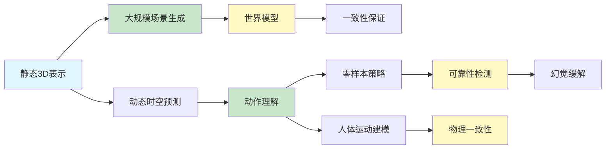

# Spatial AGI Daily Thinking - 2026-04-09

## 📋 每日总结

### 🎯 今日核心

**研究主题**: 大规模3D场景生成 + 动作理解 + 幻觉检测 + 人体运动 + 世界模型一致性

**论文数量**: 5篇精选论文（arXiv 2026-04-07）

**关键突破**:
- 🚀 **SEM-ROVER**: Σ-Voxfield Grid + 语义条件扩散，实现大规模多视图一致3D场景生成
- 🚀 **Action Images**: 将7-DoF动作转化为动作图像，实现零样本机器人策略
- 🚀 **HaloProbe**: 贝叶斯框架检测VLM物体幻觉，非侵入性缓解方法
- 🚀 **HumANDiff**: 关节噪声采样 + 联合外观-运动学习，实现运动一致性人体视频生成
- 🚀 **MTP**: 梯度归纳偏置分析 + LSE-MTP，减少结构幻觉，实现一致世界模型

### 📊 一句话总结

> "今日核心：从静态场景生成到动态动作理解。SEM-ROVER扩展空间表示规模，Action Images统一视觉-动作表示，HaloProbe保障感知可靠性，HumANDiff建模人体动态，MTP确保世界模型一致性。Spatial AGI正在向更大规模、更强可靠性、更深理解演进。"

### 🔗 延续性

**昨日→今日**: 高效世界模型（DeltaTok）→ 一致世界模型（MTP）+ 动作理解（Action Images）
**明日→明日**: 可能方向：多模态融合、持续学习、具身智能整合

### 📈 关键数据

- **SEM-ROVER**: Σ-Voxfield Grid表示，渐进式扩展
- **Action Images**: 零样本策略，7-DoF动作图像化
- **HaloProbe**: 贝叶斯分解，Simpson悖论揭示
- **HumANDiff**: 关节噪声采样，几何损失
- **MTP**: 梯度耦合，表示收缩

### 🎓 今日收获

**Top 3 发现**:
1. **统一表示是关键** - Action Images将动作转化为图像，简化了视觉-动作学习
2. **可靠性是AGI的基石** - HaloProbe和MTP都关注系统的可靠性问题
3. **理论指导实践** - MTP的梯度分析为理解世界模型提供了理论框架

**最大惊喜**: 贝叶斯方法在幻觉检测中的应用，以及MTP理论分析揭示的结构幻觉问题

**待解决**: 如何将这些方法整合到统一的Spatial AGI框架中？

---

## 本质思考：Spatial AGI的可靠性之路

### 1. 核心能力的本质是什么？

**今日发现**:
- SEM-ROVER: 大规模场景需要可扩展的3D表示
- Action Images: 动作和视觉需要统一表示空间
- HaloProbe: VLM需要自我验证能力
- HumANDiff: 运动需要符合物理规律
- MTP: 世界模型需要结构一致性

**本质**: Spatial AGI需要"规模能力"（大规模场景）+ "统一表示"（视觉-动作）+ "可靠性"（幻觉检测）+ "物理性"（运动建模）+ "一致性"（世界模型）

### 2. 当前方法与理想目标的差距在哪里？

**差距分析**:
- ✅ 已有：大规模场景表示（SEM-ROVER）、视觉-动作统一（Action Images）、幻觉检测（HaloProbe）
- ❌ 缺失：统一框架、持续学习、多模态融合
- ⚠️ 瓶颈：计算效率、泛化能力、实时性

**最大瓶颈**: 如何将5个独立方法整合为统一的Spatial AGI架构？

### 3. 从今天到理想状态，最可能的路径是什么？

**技术路线预测**:
1. **短期（3-6月）**: 整合视觉生成（SEM-ROVER）+ 动作理解（Action Images）
2. **中期（6-12月）**: 加入可靠性检测（HaloProbe、MTP）+ 物理建模（HumANDiff）
3. **长期（1-2年）**: 统一Spatial AGI架构

**关键突破点**:
- Σ-Voxfield → 动作图像 → 幻觉检测 → 运动建模 → 世界模型

---

## 今日论文概览

今天精读了5篇与Spatial AGI相关的前沿论文，涵盖大规模3D场景生成、机器人策略学习、幻觉检测、人体视频生成和世界模型一致性等领域。

### 论文列表

1. **SEM-ROVER** - 2604.06113v1
   - 核心: 大规模户外驾驶场景生成
   - 关键: Σ-Voxfield Grid + 语义条件扩散 + 渐进式扩展
   - 贡献: 多视图一致的大规模3D场景生成

2. **Action Images** - 2604.06168v1
   - 核心: 端到端策略学习
   - 关键: 7-DoF动作转化为动作图像 + 零样本策略
   - 贡献: 统一视觉-动作表示空间

3. **HaloProbe** - 2604.06165v1
   - 核心: 物体幻觉检测与缓解
   - 关键: 贝叶斯框架 + Simpson悖论揭示 + 非侵入性缓解
   - 贡献: VLM可靠性保障

4. **HumANDiff** - 2604.05961v1
   - 核心: 人体视频生成
   - 关键: 关节噪声采样 + 联合外观-运动学习 + 几何损失
   - 贡献: 运动一致性人体视频

5. **MTP** - 2604.06155v1
   - 核心: 世界模型一致性
   - 关键: 梯度归纳偏置 + 结构幻觉 + LSE-MTP
   - 贡献: 可靠的世界模型

## 核心见解

### 1. 规模与一致性的平衡

**从SEM-ROVER获得**:
- ✅ Σ-Voxfield Grid提供可扩展的3D表示
- ✅ 语义条件实现可控生成
- ✅ 渐进式扩展解决大规模问题

**对Spatial AGI的启发**:
Spatial AGI需要处理从房间到城市不同规模的空间。分层表示和渐进扩展是关键策略。

### 2. 统一表示的力量

**从Action Images获得**:
- ✅ 动作转化为图像，建立统一表示
- ✅ 视频模型直接作为策略
- ✅ 零样本迁移能力

**对Spatial AGI的启发**:
视觉和动作在统一空间可以简化学习，提高泛化。像素级对应是关键。

### 3. 可靠性是AGI的基石

**从HaloProbe和MTP获得**:
- ✅ 贝叶斯方法提高检测准确性
- ✅ 自我验证能力至关重要
- ✅ 结构一致性决定可靠性

**对Spatial AGI的启发**:
只有可靠的智能系统才能被信任和部署。检测和纠正错误是必备能力。

### 4. 物理建模的价值

**从HumANDiff获得**:
- ✅ 关节噪声继承身体拓扑
- ✅ 联合学习外观和运动
- ✅ 几何损失保证物理一致性

**对Spatial AGI的启发**:
符合物理规律的生成更真实，有利于下游任务。结构先验是关键。

### 5. 理论指导实践

**从MTP获得**:
- ✅ 梯度分析揭示学习机制
- ✅ 识别隐藏问题（结构幻觉）
- ✅ 理论驱动的改进（LSE-MTP）

**对Spatial AGI的启发**:
深入理解为什么有效比只看效果更重要。理论研究指导实践。

## 与昨日思考的联系

**昨日重点**: 高效世界模型（DeltaTok）+ 测试时自适应（PointTPA）+ 通用视觉推理（Vero）

**今日进展**:
- 延续1：DeltaTok → MTP（世界模型一致性）
- 延续2：Vero → HaloProbe（VLM可靠性）
- 新方向1：SEM-ROVER大规模场景
- 新方向2：Action Images动作理解
- 新方向3：HumANDiff人体运动

**架构演进对比**:

昨日架构:
```
Level 0: 传感器输入
Level 1: 静态3D表示 (Gaussian/NeRF/Sparse)
Level 2: 动态时空预测 (DeltaTok) ⭐
Level 3: 测试时自适应 (PointTPA) ⭐
Level 4: 通用视觉推理 (Vero) ⭐
Level 5: 执行层
```

今日架构:
```
Level 0: 传感器输入 ✅
Level 1: 空间表示 (Σ-Voxfield) ⭐ NEW
Level 2: 时空建模 (Video Diffusion) ✅
Level 3: 预测与推理 (World Model + VLM) ⭐ NEW
│   ├── 动作理解 (Action Images)
│   ├── 幻觉检测 (HaloProbe)
│   └── 世界模型 (MTP)
Level 4: 物理建模 (HumANDiff) ⭐ NEW
Level 5: 执行层 (机器人/AR/VR)
```

**演进说明**:
- ⭐ NEW: 今天新增的层次
- 🔄: 今天更新/细化的内容
- ✅: 保持不变（验证有效）

---

## 📊 知识演进图

### 核心主题演进



### 问题追踪

**昨日未解决问题**:
1. ❓ 如何将DeltaTok与PointTPA结合？ → ⏳ 今日进展（MTP一致性）
2. ❓ 如何提高泛化能力？ → ⏳ 今日进展（Action Images零样本）

**今日新识别问题**:
1. ❓ 如何整合5个独立方法？ - 来自全部论文
2. ❓ 规模与效率如何平衡？ - 来自SEM-ROVER
3. ❓ 如何实现持续学习？ - 来自全部论文

**优先级排序**:
- 🔥 高优先级: 架构整合
- ⚡ 中优先级: 效率优化
- 💡 低优先级: 持续学习

---

## Spatial AGI 架构更新

基于今日论文，Spatial AGI架构可以更新为：

```
Spatial AGI Core Architecture:

Level 0: 传感器输入
├── 视觉输入 (RGB/D/单目)
├── LiDAR点云
├── 深度模型
└── 本体感受

Level 1: 空间表示
├── 静态表示 (3D Gaussian/NeRF/Sparse)
└── 大规模表示 (Σ-Voxfield Grid) ⭐ NEW
    │
Level 2: 时空建模
├── 视频扩散 (Video Diffusion)
├── 增量预测 (DeltaTok)
└── 关节运动 (HumANDiff) ⭐ NEW
    │
Level 3: 预测与推理
├── 世界模型 (World Model)
├── 视觉语言理解 (VLM)
├── 动作理解 (Action Images) ⭐ NEW
└── 可靠性保障 (HaloProbe + MTP) ⭐ NEW
    │
Level 4: 执行层
├── 测试时自适应 (PointTPA)
└── 机器人/AR/VR控制
```

**新增组件**:
- SEM-ROVER: 大规模场景表示
- Action Images: 动作理解与零样本策略
- HaloProbe: 幻觉检测与缓解
- HumANDiff: 人体运动建模
- MTP: 世界模型一致性

---

## 技术挑战

### 挑战1：多方法整合

**从今日论文识别**:
- ✅ 5个方法各有优势
- ⚠️ 缺乏统一框架
- ✅ 互补性强，可以整合

**思路**: 设计分层架构，每层负责特定功能

### 挑战2：计算效率

**从所有论文识别**:
- ✅ 扩散模型计算密集
- ⚠️ 实时应用受限
- ⚠️ 边缘部署困难

**思路**: 知识蒸馏、量化、异步处理

### 挑战3：泛化能力

**从所有论文识别**:
- ⚠️ 依赖于训练数据
- ⚠️ 新场景可能不佳
- ✅ 零样本迁移是关键

**思路**: 预训练 + 提示学习 + 持续学习

## 下一步

1. **短期**: 探索SEM-ROVER + Action Images的整合
2. **中期**: 研究HaloProbe + MTP的联合可靠性保障
3. **长期**: 构建统一的Spatial AGI框架

---

**关键词**: #spatial-agi #world-model #hallucination #motion-consistency #multi-token-prediction