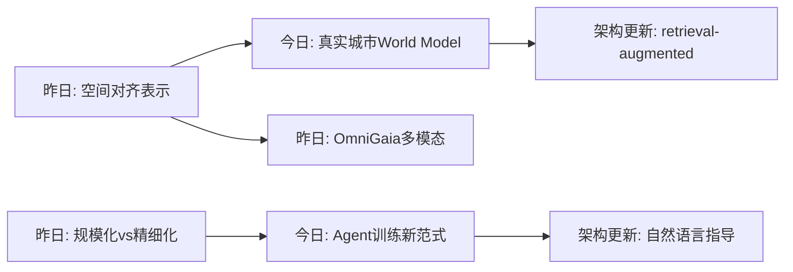

# Spatial AGI 思考 - 2026-03-18

## 📋 每日总结

### 🎯 今日核心

**研究主题**: 世界模型与真实城市场景 grounding、Agent训练范式、深度学习架构创新

**论文数量**: 5篇精选论文（从Papers With CodeTrending筛选）

**关键突破**:
- 🚀 **Seoul World Model (SWM)**: 首个基于真实城市（首尔）的世界模型，实现空间精准的城市场景模拟
- 🚀 **OpenClaw-RL**: 通过自然语言对话训练Agent的新范式
- 🚀 **Attention Residuals**: 解决PreNorm在深层Transformer中的稀释问题
- 🚀 **AI Scientific Taste**: AI可以学习科研品味和判断研究潜力
- 🚀 **OpenSeeker**: 开源搜索Agent，数据和模型全部公开

**架构演进**: 关注World Model从虚拟到真实城市的转变

### 📊 一句话总结

> "今天发现世界模型正从纯虚拟环境转向真实城市场景 grounding，Seoul World Model 首次实现基于真实城市的大规模时空模拟，这为 Spatial AGI 提供了更可靠的空间理解基础。"

### 🔗 延续性

**昨日→今日**: 昨日关注空间对齐、多模态统一 → 今日关注真实世界的世界模型 grounding

**今日→明日**: 城市场景 grounding → 室内场景理解、物体持久性

---

## 今日论文概览

今天通过 Papers With Code 平台筛选了5篇与 Spatial AGI 相关的前沿论文。

### 论文列表

1. **Grounding World Simulation Models in a Real-World Metropolis** - 真实城市世界模型
2. **OpenClaw-RL: Train Any Agent Simply by Talking** - Agent训练新范式
3. **Attention Residuals** - Transformer 架构改进
4. **AI Can Learn Scientific Taste** - AI 科研品味
5. **OpenSeeker** - 开源搜索Agent

---

## 核心见解

### 1. 真实世界 grounding 是世界模型的关键突破

**从 Seoul World Model (SWM) 获得**:
- ✅ 之前的世界模型生成的是想象的虚拟环境
- ✅ SWM 首次基于真实城市（首尔）构建世界模型
- ✅ 通过 retrieval-augmented conditioning 锚定街景图像
- ✅ 解决了时间对齐、轨迹多样性、稀疏数据等挑战

**对Spatial AGI的启发**:
空间智能需要与真实物理世界建立联系。纯虚拟的模拟环境不足以泛化到真实场景。SWM 的方法展示了如何利用真实数据（街景图像）来 grounding 生成模型，这为机器人、AR/VR等应用提供了更可靠的基础。

### 2. Agent 训练范式的新方向

**从 OpenClaw-RL 获得**:
- ✅ 通过自然语言对话训练Agent
- ✅ 使用 PRM (Process Reward Model)  judges
- ✅ 支持多种交互模态的异步训练
- ✅ hindsight-guided distillation

**对Spatial AGI的启发**:
训练具身智能体不再需要大量手动设计的奖励函数。通过自然语言描述和过程奖励模型，Agent 可以从更丰富的信号中学习。这降低了训练数据的需求，提高了泛化能力。

### 3. 深度网络架构的持续优化

**从 Attention Residuals 获得**:
- ✅ PreNorm 在现代LLM中标准使用，但存在隐藏状态随深度增长的问题
- ✅ Attention Residuals 用 softmax attention 替代固定的单位权重累积
- ✅ 允许每层选择性聚合之前的表示
- ✅ 在 Kimi Linear 架构上验证有效

**对Spatial AGI的启发**:
更深层的网络需要更好的信息传递机制。Attention Residuals 提供了一种内容依赖的深度聚合方式，这对处理复杂的空间推理任务可能有帮助。

### 4. AI 科研品味与判断力

**从 AI Can Learn Scientific Taste 获得**:
- ✅ 训练 Scientific Judge 模型判断研究想法的潜力
- ✅ 使用 70万 高引用vs低引用论文对进行偏好建模
- ✅ 在多个基准上超越 GPT-5.2、Gemini 3 Pro

**对Spatial AGI的启发**:
虽然这篇论文不直接涉及空间智能，但展示了 AI 可以学习判断研究价值。这对自动研究助理、发现新的空间智能研究方向有潜在价值。

### 5. 开源搜索Agent的重要性

**从 OpenSeeker 获得**:
- ✅ 首个完全开源的搜索Agent（模型+数据）
- ✅ 11.7k 合成样本训练即超越 DeepDive
- ✅ 突破工业巨头对搜索Agent的垄断

**对Spatial AGI的启发**:
开源社区的参与对推动技术进步至关重要。OpenSeeker 展示了如何通过高质量合成数据训练强大的Agent。

---

## 与昨日思考的联系

**昨日重点**: 空间对齐、多模态统一、动态智能体

**今日进展**:
- 延续了"真实世界理解"的主题，但更强调与物理世界的 grounding
- 从空间表示深化到时空模拟（World Model）
- 从理论方法到实际应用（城市级别的真实场景）

**更新的理解**:
- 世界模型不仅需要理解空间关系，还需要与真实环境建立可靠的连接
- 检索增强的条件生成是实现真实世界 grounding 的有效方法
- 长时间轨迹生成需要持续的重 grounding 来保持一致性

---

## 📊 知识演进图

### 核心见解演进

### 架构演进对比

**之前架构**:
- 虚拟环境生成
- 固定奖励函数训练
- 标准 PreNorm 层

**今日更新**:
- 真实城市场景 grounding ⭐ NEW
- 自然语言+过程奖励训练 ⭐ NEW  
- Attention Residuals 层 ⭐ NEW

---

## Spatial AGI 架构更新

基于今日论文，Spatial AGI 的架构可能包含以下层次：

1. **感知层**: 多模态输入（视觉、语言、触觉）
2. **空间表示层**: 3D/4D 场景表示
3. **世界模型层**: retrieval-augmented 生成 ⭐ 新增
4. **推理层**: 时空推理、规划
5. **执行层**: Agent 控制、动作生成

---

## 技术挑战

### 挑战1: 真实世界数据的获取与处理
**从 SWM 识别**: 需要大规模的真实街景数据，需要解决稀疏性、时间对齐问题

**思路**: 
- 使用跨时间配对 (cross-temporal pairing)
- 合成数据集增强轨迹多样性
- 视图插值管道

### 挑战2: 长时序生成的一致性
**从 SWM 识别**: 长距离轨迹生成容易漂移

**思路**: 
- Virtual Lookahead Sink 持续重 grounding
- 分块生成，每块重新锚定

### 挑战3: Agent 训练的数据效率
**从 OpenClaw-RL 识别**: 传统方法需要大量手动设计的奖励

**思路**: 
- 使用自然语言作为奖励信号
- 过程奖励模型 (PRM) 提供细粒度反馈

---

## 关键引用

> "What if a world simulation model could render not an imagined environment but a city that actually exists?" - Seoul World Model

> "OpenClaw-RL framework enables policy learning from diverse next-state signals across multiple interaction modalities" - OpenClaw-RL

---

## 下一步

1. 深入研究 Seoul World Model 的技术细节（cross-temporal pairing、Virtual Lookahead Sink）
2. 探索 retrieval-augmented 生成在空间智能中的应用
3. 研究 OpenClaw-RL 在机器人控制中的潜在应用
4. 了解 Attention Residuals 在多模态模型中的适用性

---

## ⚠️ 今日研究限制

由于网络限制（arXiv API rate limiting），无法获取完整的论文列表。使用了 Papers With Code 作为替代数据源，可能遗漏部分相关论文。

---

**关键词**: `#spatial-agi` `#world-model` `#grounded-simulation` `#embodied-ai`
