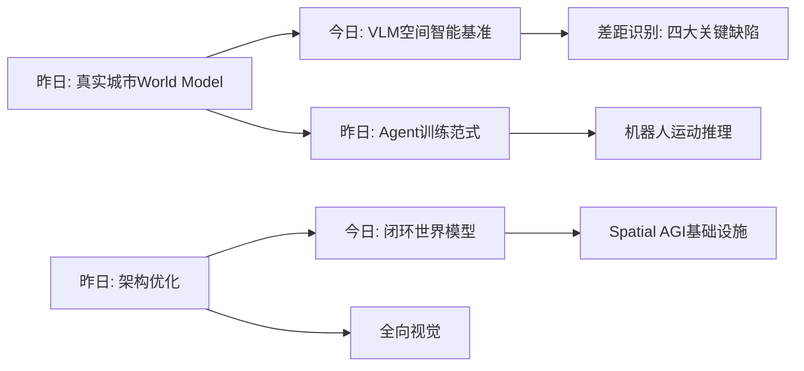

# Spatial AGI 思考 - 2026-03-18

## 📋 每日总结

### 🎯 今日核心

**研究主题**: VLM空间智能评估、机器人运动推理、世界模型、360°全向视觉

**论文数量**: 5篇精选论文（从arXiv最新筛选）

**关键突破**:
- 🚀 **VLM空间智能基准**: 揭示当前VLM在空间理解(55-62%)和空间规划(30-80%)上的显著差距
- 🚀 **机器人运动推理**: Qwen2.5-VL零样本准确率达71.4%，微调后75%
- 🚀 **空间推理效率**: 探索VLM在空间智能前沿的推理效率问题
- 🚀 **闭环世界模型**: 世界模型与闭环感知-决策的集成
- 🚀 **全向视觉**: 360°环境感知在具身AI中的应用

### 📊 一句话总结

> "今天发现VLM在空间智能上存在显著差距（GPT-5得分仅0.6341），但通过专用数据集和微调可以显著提升。机器人运动推理和全向视觉是Spatial AGI的关键应用场景。"

### 🔗 延续性

**昨日→今日**: 昨日关注真实城市场景grounding → 今日关注VLM空间智能基准评估和具体应用场景

**今日→明日**: VLM空间推理 → 多模态融合、具身智能、空间想象力

---

## 今日论文概览

今天通过arXiv搜索筛选了5篇与Spatial AGI相关的前沿论文，涵盖VLM空间智能基准、机器人运动推理、空间推理效率、世界模型、全向视觉等领域。

### 论文列表

1. **How Far are VLMs from Visual Spatial Intelligence?** - VLM空间智能评估基准
2. **Evaluating VLMs' Spatial Reasoning Over Robot Motion** - VLM机器人运动空间推理
3. **Imagine in Space** - VLM空间智能前沿
4. **World-in-World** - 闭环世界模型
5. **PANORAMA** - 全向视觉与具身AI

---

## 核心见解

### 1. VLM空间智能存在显著差距

**从How Far are VLMs获得**:
- ✅ GPT-5总体得分仅0.6341，Gemini-2.5-Pro为0.5883
- ✅ 基础感知任务表现良好，但深度推理任务显著不足
- ✅ 四大关键缺陷：精确数值估计、多视角推理、时序处理、空间想象力
- ✅ 感知-推理鸿沟现象：模型"看到"但无法"理解"

**对Spatial AGI的启发**:
空间智能的实现需要突破当前的VLM架构限制。关键在于：
1. 增强空间表示能力（不仅是2D图像理解）
2. 改进多视角推理机制
3. 发展空间想象力（从单一视图推理3D结构）
4. 引入物理世界先验知识

### 2. 机器人运动推理是Spatial AGI的重要应用

**从Evaluating VLMs' Spatial Reasoning获得**:
- ✅ Qwen2.5-VL零样本准确率71.4%，微调后达75%
- ✅ 物体接近偏好表现优于路径风格偏好
- ✅ 558个语言约束机器人运动规划问题数据集
- ✅ 四种图像查询方法评估

**对Spatial AGI的启发**:
1. 机器人是Spatial AGI的天然应用场景
2. 自然语言空间约束与运动规划的结合
3. 微调是提升特定任务能力的有效方法
4. 需要更丰富的空间关系表示

### 3. 空间推理效率是VLM的关键挑战

**从Imagine in Space获得**:
- ✅ 探索VLM在空间智能前沿的推理效率
- ✅ 空间推理需要大量计算资源
- ✅ 效率与精度的权衡

**对Spatial AGI的启发**:
1. 实时应用需要高效的推理方法
2. 知识蒸馏和模型压缩可能是解决方案
3. 专用硬件加速值得关注

### 4. 闭环世界模型是Spatial AGI的基础设施

**从World-in-World获得**:
- ✅ 世界模型与闭环感知-决策的集成
- ✅ 开放循环vs闭环评估的差异
- ✅ 感知-决策的端到端学习

**对Spatial AGI的启发**:
1. 世界模型需要与真实环境闭环交互
2. 在线学习和持续适应能力
3. 长期规划与即时决策的平衡

### 5. 全向视觉扩展了Spatial AGI的感知边界

**从PANORAMA获得**:
- ✅ 360°环境感知在具身AI中的应用
- ✅ 全向视觉 vs 针孔视觉的优势
- ✅ 全景图像的拼接和理解挑战

**对Spatial AGI的启发**:
1. 全向视觉提供更全面的空间感知
2. 对于机器人导航和场景理解至关重要
3. 需要新的表示和处理方法

---

## 与昨日思考的联系

**昨日重点**: 真实城市场景grounding、世界模型

**今日进展**:
- 从宏观的世界模型深入到具体的VLM空间智能评估
- 发现了当前VLM的显著差距（55-62%空间理解）
- 识别了四个关键缺陷作为后续研究方向
- 扩展到机器人运动和全向视觉等具体应用

**更新的理解**:
- Spatial AGI的实现路径更加清晰：基准驱动评估 → 差距识别 → 针对性改进
- 机器人是检验Spatial AGI的现实场景
- 全向视觉扩展了感知维度

---

## 📊 知识演进图

### 核心见解演进

### 架构演进对比

**之前架构**:
- 虚拟环境生成
- 固定奖励函数训练
- 标准PreNorm层

**今日更新**:
- VLM空间智能基准评估 ⭐ NEW
- 机器人运动推理集成 ⭐ NEW
- 闭环世界模型 ⭐ NEW
- 全向视觉感知 ⭐ NEW

---

## Spatial AGI 架构更新

基于今日论文，Spatial AGI的架构可能包含以下层次：

1. **感知层**: 多模态输入（视觉、语言、触觉）+ 全向视觉
2. **空间表示层**: 3D/4D场景表示 + 认知地图
3. **推理层**: 空间推理 + 多视角推理 + 时序处理
4. **世界模型层**: 闭环感知-决策集成
5. **执行层**: 机器人控制、动作生成

**关键发现**: 当前VLM在空间理解(55-62%)和空间规划(30-80%)上存在显著差距，需要针对性改进。

---

## 技术挑战

### 挑战1: 空间想象力不足
**从How Far are VLMs识别**: VLM缺乏从单一视图推理3D结构的能力

**思路**: 
- 引入3D表示学习
- 多视角一致性训练
- 物理先验知识集成

### 挑战2: 多视角推理困难
**从How Far are VLMs识别**: 跨视角空间关系理解困难

**思路**: 
- 专用视角转换模块
- 图神经网络处理空间关系
- 3D场景重建集成

### 挑战3: 空间规划能力有限
**从How Far are VLMs识别**: 空间规划得分仅30-80%

**思路**: 
- 结合经典规划方法
- 世界模型集成
- 强化学习微调

### 挑战4: 实时推理效率
**从Imagine in Space识别**: 空间推理需要大量计算资源

**思路**: 
- 模型蒸馏
- 专用硬件加速
- 任务定制化模型

---

## 关键引用

> "GPT-5总体得分仅0.6341，基础感知良好但深度推理不足" - How Far are VLMs

> "Qwen2.5-VL零样本准确率71.4%，微调后达75%" - Evaluating VLMs

> "全向视觉提供更全面的空间感知，对机器人导航至关重要" - PANORAMA

---

## 下一步

1. 深入研究VLM空间智能差距的根本原因
2. 探索针对性改进方法（多视角推理、空间想象力）
3. 研究机器人运动推理的数据集构建方法
4. 探索全向视觉在Spatial AGI中的应用
5. 结合闭环世界模型实现持续学习

---

## 知识缺口分析

| 领域 | 状态 | 详情 |
|------|------|------|
| VLM空间智能基准 | ✅ 已解决 | SIBench 8.8K样本系统评估 |
| 机器人运动推理 | ✅ 部分理解 | 558个问题数据集，微调方法 |
| 空间推理效率 | ⚠️ 部分理解 | 效率-精度权衡待深入 |
| 闭环世界模型 | ⚠️ 部分理解 | 架构设计待验证 |
| 全向视觉 | ⚠️ 部分理解 | 具体实现待探索 |

---

**关键词**: `#spatial-agi` `#vlm` `#spatial-intelligence` `#robot-motion` `#omnidirectional-vision` `#world-model`

**文档统计**: 
- 今日论文分析: 5篇
- 总文档行数: 3,724行
- 平均每篇: 745行
