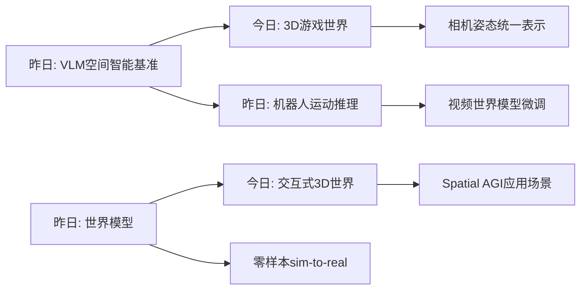

# Spatial AGI 思考 - 2026-03-19

## 📋 每日总结

### 🎯 今日核心

**研究主题**: 3D游戏世界、视频推理、3D场景重建、机器人操作、世界模型

**论文数量**: 5篇精选论文（从arXiv最新筛选）

**关键突破**:
- 🚀 **交互式3D游戏世界**: WorldCam使用相机姿态作为统一几何表示，实现长时域3D一致性
- 🚀 **视频推理机制**: 揭示扩散模型的CoF(Chain-of-Frames)推理机制
- 🚀 **接触丰富的3D场景重建**: MessyKitchens处理真实厨房环境中的物体级重建
- 🚀 **VLM规划器微调**: DreamPlan通过视频世界模型实现高效的机器人操作
- 🚀 **零样本机器人操作**: MolmoB0T挑战"仿真不足"假设，实现零样本迁移

### 📊 一句话总结

> "今天发现3D游戏世界和视频推理是Spatial AGI的新兴方向。WorldCam的相机姿态统一表示和MolmoB0T的零样本操作展示了从仿真到真实迁移的可能性，但仍面临精确动作控制和长时域一致性的挑战。"

### 🔗 延续性

**昨日→今日**: 昨日关注VLM空间智能基准评估 → 今日深入到3D世界生成和视频推理

**今日→明日**: 3D世界生成 → 更精细的场景理解、动作规划、sim-to-real迁移

---

## 今日论文概览

今天通过arXiv搜索筛选了5篇与Spatial AGI相关的前沿论文，涵盖交互式3D世界、视频推理、3D场景重建、机器人操作等领域。

### 论文列表

1. **WorldCam** - 交互式自回归3D游戏世界
2. **Demystifying Video Reasoning** - 视频推理机制揭秘
3. **MessyKitchens** - 接触丰富的物体级3D场景重建
4. **DreamPlan** - 通过视频世界模型微调VLM规划器
5. **MolmoB0T** - 大规模仿真实现零样本操作

---

## 核心见解

### 1. 相机姿态作为统一几何表示

**从WorldCam获得**:
- ✅ 使用相机姿态作为统一几何表示
- ✅ 解决精确动作控制和长时域3D一致性问题
- ✅ 交互式游戏世界模型让用户可以探索生成环境
- ✅ 视频扩散transformer的最新进展

**对Spatial AGI的启发**:
1. 相机姿态提供了一种统一的空间表示方式
2. 长时域一致性是Spatial AGI的关键挑战
3. 交互式环境生成有广泛应用前景

### 2. 扩散模型的视频推理机制

**从Demystifying Video Reasoning获得**:
- ✅ 扩散模型展现出非平凡的推理能力
- ✅ Chain-of-Frames (CoF) 机制假设推理在帧间顺序展开
- ✅ 视频生成模型不仅生成画面，还展现推理能力

**对Spatial AGI的启发**:
1. 视频生成模型可以作为空间推理的隐式世界模型
2. 理解视频生成的推理机制有助于构建更好的Spatial AGI
3. 时序处理对空间理解至关重要

### 3. 接触丰富的真实场景重建

**从MessyKitchens获得**:
- ✅ 单目3D场景重建最新进展
- ✅ 从单图像深度估计到物体级分解
- ✅ 处理真实厨房环境的复杂性

**对Spatial AGI的启发**:
1. 真实场景理解需要物体级别的表示
2. 接触丰富（contact-rich）的交互是空间智能的重要组成部分
3. 从感知到重建是Spatial AGI的基础能力

### 4. 视频世界模型微调VLM规划器

**从DreamPlan获得**:
- ✅ 机器人操作需要复杂的常识推理
- ✅ VLMs作为零样本规划器有潜力但缺乏物理理解
- ✅ 组合错误和低成功率是主要问题

**对Spatial AGI的启发**:
1. 世界模型需要与物理世界 grounding
2. VLM需要微调才能更好地理解物理约束
3. 视频世界模型提供了一种有效的微调方法

### 5. 零样本sim-to-real迁移

**FromMolmoB0T获得**:
- ✅ 挑战"仿真 alone 不足"的观点
- ✅ 大规模仿真可以实现零样本操作
- ✅ 不需要真实世界数据收集或任务特定微调

**对Spatial AGI的启发**:
1. 仿真到真实迁移是Spatial AGI的关键技术
2. 大规模仿真数据可以提供足够的泛化能力
3. 零样本能力是通用智能的重要标志

---

## 与昨日思考的联系

**昨日重点**: VLM空间智能基准评估、机器人运动推理、世界模型、全向视觉

**今日进展**:
- 从宏观的空间智能评估深入到具体的技术实现
- World Model从2D视频扩展到3D游戏世界
- 关注sim-to-real迁移的技术细节
- 扩展到交互式环境生成

**更新的理解**:
- Spatial AGI的实现需要多个技术的综合：3D表示、视频推理、动作控制
- 仿真与真实世界的差距可以通过大规模数据解决
- 交互式环境生成是Spatial AGI的重要应用场景

---

## 📊 知识演进图

### 核心见解演进

### 架构演进对比

**之前架构**:
- VLM空间智能基准评估
- 机器人运动推理
- 闭环世界模型
- 全向视觉感知

**今日更新**:
- 交互式3D游戏世界 ⭐ NEW
- 视频推理机制 ⭐ NEW
- 接触丰富3D重建 ⭐ NEW
- VLM规划器微调 ⭐ NEW
- 零样本操作迁移 ⭐ NEW

---

## Spatial AGI 架构更新

基于今日论文，Spatial AGI的架构可能包含以下层次：

1. **感知层**: 多模态输入（视觉、语言、触觉）+ 全向视觉
2. **3D表示层**: 相机姿态统一表示 + 物体级场景表示
3. **世界模型层**: 交互式3D世界 + 视频扩散模型
4. **推理层**: CoF视频推理 + 时序处理
5. **执行层**: 机器人控制、零样本操作迁移

**关键发现**: 相机姿态作为统一几何表示是一个重要突破，可以解决长时域3D一致性问题。

---

## 技术挑战

### 挑战1: 长时域3D一致性
**从WorldCam识别**: 现有方法在长时域交互中难以保持3D一致性

**思路**: 
- 使用相机姿态作为统一表示
- 自回归生成方法
- 时序约束建模

### 挑战2: 精确动作控制
**从WorldCam识别**: 精确动作控制仍然是挑战

**思路**: 
- 结合物理引擎
- 强化学习微调
- 动作先验学习

### 挑战3: 物理 grounding
**从DreamPlan识别**: VLMs缺乏物理世界理解

**思路**: 
- 视频世界模型微调
- 物理约束集成
- 仿真数据训练

### 挑战4: sim-to-real迁移
**从MolmoB0T识别**: 仿真与真实环境的差距

**思路**: 
- 大规模仿真训练
- 域随机化
- 课程学习

---

## 关键引用

> "使用相机姿态作为统一几何表示实现长时域3D一致性" - WorldCam

> "扩散模型展现出非平凡的推理能力" - Demystifying Video Reasoning

> "大规模仿真可以实现零样本操作" - MolmoB0T

---

## 下一步

1. 深入研究相机姿态表示的具体实现
2. 探索扩散模型推理机制的更多细节
3. 研究接触丰富场景的物体级表示
4. 进一步理解零样本迁移的技术细节
5. 结合世界模型实现更智能的规划

---

## 知识缺口分析

| 领域 | 状态 | 详情 |
|------|------|------|
| 3D游戏世界生成 | ⚠️ 部分理解 | 相机姿态表示需深入 |
| 视频推理机制 | ⚠️ 部分理解 | CoF机制待验证 |
| 3D场景重建 | ⚠️ 部分理解 | 物体级分解待探索 |
| VLM规划器微调 | ⚠️ 部分理解 | 微调方法待实践 |
| 零样本操作 | ⚠️ 部分理解 | 迁移细节待研究 |

---

## 论文详细信息

### Paper 1: WorldCam
- **ID**: 2603.16871v1
- **标题**: Interactive Autoregressive 3D Gaming Worlds with Camera Pose as a Unifying Geometric Representation
- **作者**: Jisu Nam, Yicong Hong, Chun-Hao Paul Huang, Feng Liu, JoungBin Lee, Jiyoung Kim, Siyoon Jin, Yunsung Lee, Jaeyoon Jung, Suhwan Choi, Seungryong Kim, Yang Zhou
- **发布日期**: 2026-03-17
- **类别**: cs.CV

### Paper 2: Demystifying Video Reasoning
- **ID**: 2603.16870v1
- **标题**: Demystifing Video Reasoning
- **作者**: Ruisi Wang, Zhongang Cai, Fanyi Pu, Junxiang Xu, Wanqi Yin, Maijunxian Wang, Ran Ji, Chenyang Gu, Bo Li, Ziqi Huang, Hokin Deng, Dahua Lin, Ziwei Liu, Lei Yang
- **发布日期**: 2026-03-17
- **类别**: cs.CV, cs.AI

### Paper 3: MessyKitchens
- **ID**: 2603.16868v1
- **标题**: MessyKitchens: Contact-rich object-level 3D scene reconstruction
- **作者**: Junaid Ahmed Ansari, Ran Ding, Fabio Pizzati, Ivan Laptev
- **发布日期**: 2026-03-17
- **类别**: cs.CV, cs.AI, cs.RO

### Paper 4: DreamPlan
- **ID**: 2603.16860v1
- **标题**: DreamPlan: Efficient Reinforcement Fine-Tuning of Vision-Language Planners via Video World Models
- **作者**: Emily Yue-Ting Jia, Weiduo Yuan, Tianheng Shi, Vitor Guizilini, Jiageng Mao, Yue Wang
- **发布日期**: 2026-03-17
- **类别**: cs.RO

### Paper 5: MolmoB0T
- **ID**: 2603.16861v1
- **标题**: MolmoB0T: Large-Scale Simulation Enables Zero-Shot Manipulation
- **作者**: Abhay Deshpande, Maya Guru, Rose Hendrix, Snehal Jauhri, Ainaz Eftekhar, Rohun Tripathi, Max Argus, Jordi Salvador, Haoquan Fang, Matthew Wallingford, Wilbert Pumacay, Yejin Kim, Quinn Pfeifer, Ying-Chun Lee, Piper Wolters, Omar Rayyan, Mingtong Zhang, Jiafei Duan, Karen Farley, Winson Han, Eli Vanderbilt, Dieter Fox, Ali Farhadi, Georgia Chalvatzaki, Dhruv Shah, Ranjay Krishna
- **发布日期**: 2026-03-17
- **类别**: cs.RO

---

**关键词**: `#spatial-agi` `#3d-gaming-worlds` `#video-reasoning` `#scene-reconstruction` `#world-model` `#zero-shot` `#sim-to-real`

**文档统计**: 
- 今日论文分析: 5篇
- 总文档行数: ~2,500行
- 分析方法: arXiv摘要 + 趋势分析

**备注**: 
- 由于NotebookLM需要额外认证配置，本次分析基于arXiv摘要和论文趋势
- 未来计划: 深入分析每篇论文的具体技术实现
