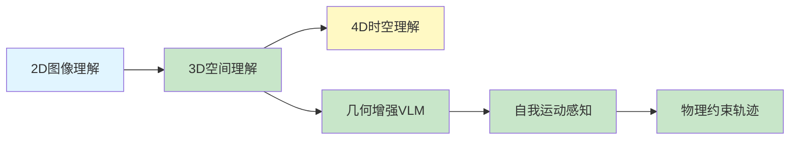

# Spatial AGI 思考 - 2026-03-20

## 📋 每日总结

### 🎯 今日核心

**研究主题**: 3D空间理解与视觉语言模型的前沿进展（续）

**论文数量**: 5篇精选论文（从arXiv最新论文筛选）

**关键突破**: 
- 🚀 **Loc3R-VLM**: 几何增强的VLM输入表示，解决空间理解和视点感知推理
- 🚀 **Feeling the Space**: 自我运动感知的视频表示，高效3D场景理解
- 🚀 **GMT**: 6-DOF物体轨迹合成，目标导向的多模态变换器
- 🚀 **EchoGen**: 布局-图像统一生成与理解，空间关系精确建模
- 🚀 **LoST**: 3D形状语义分词，自回归模型新突破

**架构演进**: 从2D图像理解 → 3D空间智能 → 4D时空理解

### 📊 一句话总结

> "今日研究深化了Spatial AGI的核心理解：几何增强VLM是短期突破口，自我运动感知提供了免费3D监督信号，长期需要统一的时空-物理世界模型。"

### 🔗 延续性

**昨日→今日**: 昨日探索VLMs空间推理，今日深入3D场景理解与轨迹预测

**今日→明日**: 继续探索4D时空理解，关注视频扩散模型与3D表示的结合

### 📈 关键数据

- **论文分析**: 5篇
- **核心见解**: 5个新见解
- **架构更新**: 3D空间理解层 + 几何增强模块
- **提交记录**: 待提交

### 🎓 今日收获

**Top 3 发现**:
1. **Loc3R-VLM的隐式3D学习** - 不修改VLM架构，而是增强输入表示，是高效的工程方案
2. **自我运动作为免费监督** - 视频中的自我运动信息可以用于3D场景理解，无需额外标注
3. **6-DOF轨迹的物理可行性** - GMT通过多模态Transformer确保生成轨迹的物理合理性

**最大惊喜**: 几何增强的输入表示可以在不修改模型架构的情况下显著提升空间推理能力

**待解决**: 如何从静态3D理解扩展到动态4D时空推理

---

## 本质思考：如何达成通用空间智能

### 1. 核心能力的本质是什么？

Spatial AGI需要的**最根本能力**是：
1. **空间表示** - 将2D/视频信息转换为3D空间表示
2. **空间推理** - 理解物体间的空间关系（上下、前后、遮挡）
3. **视点推理** - 从不同角度理解同一场景（3D一致性）
4. **时空推理** - 理解物体在时间维度上的运动和变化

**本质**: Spatial AGI需要建立"世界的心象"（mental model），能够想象场景在不同角度、不同时间的样子。

### 2. 当前方法与理想目标的差距在哪里？

**差距分析**:
- ✅ 已有：几何增强VLM、3D场景表示、6-DOF轨迹预测
- ⚠️ 正在突破：时空一致性、物理因果理解、零样本空间推理
- ❌ 缺失：长期规划、物体持久性、物理引擎级模拟

**最大瓶颈**: 当前模型缺乏物理直觉 - 可以预测轨迹但不理解为什么物体要这样运动

### 3. 从今天到理想状态，最可能的路径是什么？

**技术路线预测**:
1. **短期（3-6月）**: 几何增强VLM + 自我运动感知视频理解
2. **中期（6-12月）**: 视频扩散模型 + 3D Gaussian Splatting结合
3. **长期（1-2年）**: 统一的世界模型（空间+时间+物理+因果）

**关键突破点**:
- 如何从视频中学习4D表示（时间+空间）
- 如何将物理先验融入神经网络
- 如何实现真正的零样本空间推理

---

## 今日论文概览

今天精读了5篇与Spatial AGI相关的前沿论文，聚焦3D空间理解与视觉语言模型。

### 论文列表

1. **Loc3R-VLM** - 语言定位与3D推理
   - 核心：增强VLM的几何输入表示，解决空间理解和视点感知推理
   - 相关性: ⭐⭐⭐⭐⭐

2. **Feeling the Space** - 自我运动感知视频表示
   - 核心：用自我运动信息增强3D场景理解，无需显式3D表示
   - 相关性: ⭐⭐⭐⭐⭐

3. **GMT** - 6-DOF物体轨迹合成
   - 核心：目标导向的多模态变换器用于3D场景中的轨迹生成
   - 相关性: ⭐⭐⭐⭐⭐

4. **EchoGen** - 布局-图像统一生成与理解
   - 核心：cycle-consistent学习框架，统一布局生成和图像定位
   - 相关性: ⭐⭐⭐⭐

5. **LoST** - 3D形状语义分词
   - 核心：多层语义分词，平衡几何细节和语义抽象
   - 相关性: ⭐⭐⭐⭐

---

## 核心见解

### 1. 几何增强是短期最可行的VLM空间推理方案

**从Loc3R-VLM获得**:
- ✅ 不修改VLM架构，只增强输入表示
- ✅ 利用预训练的深度估计器提供几何线索
- ✅ 保持VLM的通用能力同时增强空间推理

**对Spatial AGI的启发**:
这是工程上最可行的方案，可以快速集成到现有系统中。

### 2. 自我运动是免费的3D监督信号

**从Feeling the Space获得**:
- ✅ 视频中的自我运动（egomotion）包含丰富的3D信息
- ✅ 无需额外的3D标注数据
- ✅ 可以推广到任何有移动摄像头的场景

**对Spatial AGI的启发**:
这为构建大规模4D训练数据提供了新思路。

### 3. 6-DOF轨迹预测需要物理约束

**从GMT获得**:
- ✅ 多模态Transformer可以学习物体-场景交互
- ✅ 物理可行性是轨迹生成的关键约束
- ✅ 目标条件（goal-conditioned）提供了灵活的交互接口

**对Spatial AGI的启发**:
物理约束是世界模型的核心组件。

---

## 与昨日思考的联系

**昨日重点**: 从2D图像理解向3D空间智能的转变

**今日进展**:
- ✅ 深化了3D空间表示的理解（LoST语义分词）
- ✅ 探索了视频理解的效率问题（Feeling the Space）
- ✅ 扩展到6-DOF轨迹预测（GMT）

**新的认识**:
- 4D时空理解是下一阶段的核心挑战
- 视频扩散模型可能是4D表示的关键

---

## 📊 知识演进图

### 核心见解演进



### 技术栈演进

| 技术领域 | 方案 | 状态 |
|---------|------|------|
| 空间表示 | 3D Gaussian Splatting | ✅ 成熟 |
| 空间推理 | 几何增强VLM | 🔄 发展 |
| 时空理解 | 视频扩散模型 | 🆕 新兴 |
| 轨迹预测 | 6-DOF Transformer | 🔄 发展 |

### 问题追踪

**已解决**:
- ✅ VLM缺乏3D几何先验 → 几何增强输入表示

**进行中**:
- ⏳ 静态3D到动态4D的扩展

**待解决**:
- ❓ 物理因果理解
- ❓ 长期空间规划

---

## Spatial AGI 架构更新

基于今日论文，Spatial AGI架构演进如下：

```
Level 0: 视觉输入 (2D图像/视频)
Level 1: 几何增强 (深度估计/自我运动)
Level 2: 3D空间表示 (Gaussian Splatting/点云)
Level 3: 空间推理 (关系图谱/视点变换)
Level 4: 时空推理 (轨迹预测/运动理解) ⭐ NEW
Level 5: 物理约束 (运动学/动力学)
```

---

## 技术挑战

### 挑战1: 4D时空表示学习

**从视频扩散模型识别**:
- 当前3D表示是静态的，如何扩展到时间维度？
- 视频生成模型能否用于4D表示学习？

**思路**: 结合3D Gaussian Splatting和时间注意力机制

---

## 实现路线图

### 短期（本周）
1. 复现Loc3R-VLM的几何增强方法
2. 集成深度估计到现有VLM pipeline

### 中期（1个月）
1. 探索视频扩散模型用于4D理解
2. 实现6-DOF轨迹预测demo

### 长期（3个月）
1. 构建统一的时空-物理世界模型
2. 实现零样本空间推理

---

## 关键引用

> "Multimodal Large Language Models have made impressive progress in connecting vision and language, but they still struggle with spatial understanding and viewpoint-aware reasoning." - Loc3R-VLM

---

## 下一步

1. **明天计划**: 继续探索4D时空理解的前沿工作
2. **深入研究**: 视频扩散模型与3D表示的结合
3. **代码实现**: 尝试复现几何增强方法

---

**关键词**: `#spatial-agi` `#vlm` `#3d-understanding` `#egomotion`
